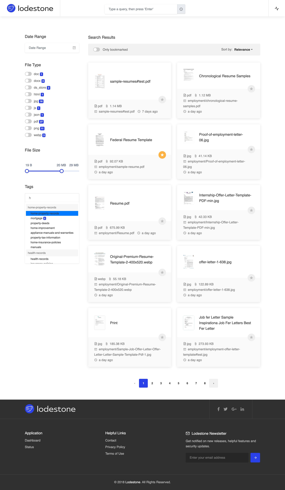

# Lodestone - Personal Document Search & Archive

[](https://github.com/AnalogJ/lodestone/blob/master/LICENSE)
[](https://hub.docker.com/r/analogj/lodestone)
[](https://gitter.im/lodestone-chat/devs)
[](https://forms.gle/u1RXnbocbFWqfxGb9)


> NOTE: Lodestone is a Work-in-Progress and is not production ready.
>
> If you want to be a tester/developer, please fill out this Google Form with your contact information: https://forms.gle/u1RXnbocbFWqfxGb9


Lodestone is designed to be the modern and digital equivalent of a home filing cabinet.
If you've gone searching for something similar in the past, you might be familiar with terms like Electronic Document
Management System (EDMS), Document Management System (DMS) or Personal Archival.

Lodestone is designed around a handful of core features:

- **Full text document search** - It doesn't matter what format you're document is in, we should be able to parse it (using OCR) and let you search for the text.
- **Rich tagging** - Unlike a physical file cabinet where a document can only exist in one place, digital documents support tags, allowing you to create a flexible organizational structure that works for you.
- **Automated** - Document collection & OCR processing should be automatic. Just saving a file to your network drive should be enough to start document processing.
- **Non-destructive** - When Lodestone processes a document, the original file will be left untouched, exactly where you left it.
- **Web Accessible** - Lodestone is designed to run on a trusted home server and be accessible 24x7.
- **Filesystem/Cloud Sync** - Optionally synchronize your tagged documents via a cloud storage provider of your choice (Dropbox, GDrive, etc) or access via a FUSE filesystem mount.

# Screenshot



More screenshots available in the [docs/screenshots](docs/screenshots) directory.


# Installation
Lodestone is made up of a handful of open-source components, and as such its easiest to deploy using Docker/Docker Compose

```bash
docker-compose up

# then open the following url in your browser

http://localhost:4000/

```

If you would like some test documents to play with safely, you can take a look at the [AnalogJ/lodestone-test-docs](https://github.com/AnalogJ/lodestone-test-docs)
repository.

### Notes:
If your documents already exist, you may need to touch the files in the watchfolder directory to trigger parsing by fscrawler.

`find . -exec touch {} \;`


# Considerations
Lodestone is a very opinionated solution for personal document management. As such, there's a couple things you should know before even considering it.

- Currently there's no user management. Lodestone is designed to run at home, on your trusted network. This may be reconsidered at a future date.
- Limited support for file types
    - `doc`,`docx`,`xls`,`xlsx`, `ppt`, `pptx` - Microsoft Office Documents
    - `pages`, `numbers`, `key` - Apple iWork Documents
    - `pdf`
    - `rtf`
    - `jpg`, `jpeg`, `png`, `tiff`, `tif`

    If you think there are additional document types that may be useful to support, please open an issue.


# What about..

As mentioned above, Lodestone isn't some magical new technology. EDMS and DMS systems have been around for a long time,
but unfortunately they all seem to miss one or more features that I think are required for a modern filing cabinet.

Here's some of my research, but you should take a look at them yourselves.

| Name  | Docker/Linux | Web UI | Modern UI | Tagging | Non-destructive | OCR | Watch Folder | Email Import |
| --- | :---: | :---: | :---: | :---: | :---: | :---: | :---: | :---: |
| [MayanEDMS](https://www.mayan-edms.com/) | :white_check_mark: | :white_check_mark: | :white_check_mark: | :white_check_mark: | :x: | :white_check_mark: | :white_check_mark: | :white_check_mark: |
| [Paperless](https://github.com/the-paperless-project/paperless) | :white_check_mark: | :white_check_mark: | :heavy_exclamation_mark: | :white_check_mark: | :x: | :white_check_mark: | :white_check_mark: | :white_check_mark: |


# Contributing

If you're interested in contributing, please fill out the following Google Form:

https://forms.gle/u1RXnbocbFWqfxGb9


```bash
# run the following command in 1 terminal
docker-compose up -f docker-compose.dev.yml --force-recreate --build

# and the following in a different terminal
cd web && ng build --output-path ./dist --base-href "/" --prod --watch
```

If you would like some test documents to play with safely, you can take a look at the [AnalogJ/lodestone-test-docs](https://github.com/AnalogJ/lodestone-test-docs)
repository.

`find . -exec touch {} \;`


# Future Development
Here's some of the feature's that we have targeted for future development. Check the [Lodestone Project](https://github.com/AnalogJ/lodestone/projects/1) for in-progress development status.

- **(In-Progress)** Thumbnail Generation
- Additional file types
- Optional tag synchronization to cloud storage providers (Dropbox, Google Drive, etc)
- Metadata Backup/Export system
- Email Collector (send emails to a customizable email address, and automatically parse into lodestone).
- Full API platform
- User management system


# Logo
- [rock by Dobs from the Noun Project](https://thenounproject.com/term/rock/481051)
